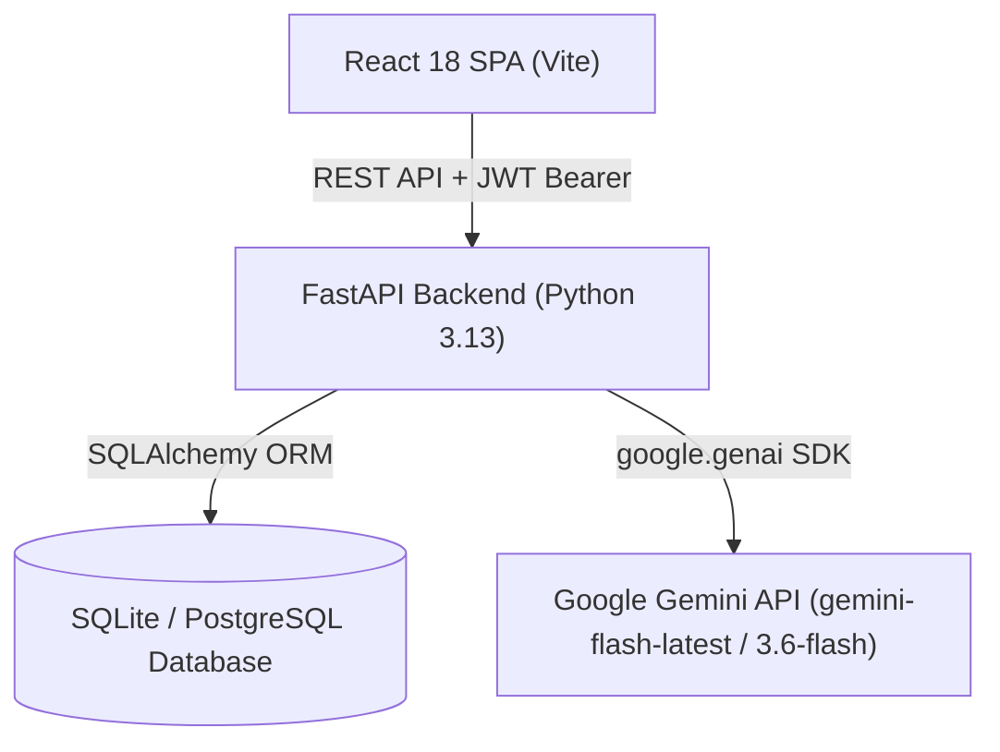

# AI Risk Manager 🛡️🤖
### Next-Generation AI-Powered Risk Assessment & Mitigation Platform

[](https://fastapi.tiangolo.com/)
[](https://react.dev/)
[](https://vitejs.dev/)
[](https://ai.google.dev/)
[](https://python.org)
[](LICENSE)

**AI Risk Manager** is an enterprise-grade software risk intelligence platform. Powered by Google Gemini AI, it analyzes software project specifications, architectural context, and tech stacks to automatically identify, score, categorize, and provide step-by-step mitigation plans across 8 critical risk dimensions.

---

## ✨ Key Features

* 🚀 **Automated AI Risk Analysis**: Analyzes project specifications in $<10$ seconds using Google Gemini (`gemini-flash-latest`, `gemini-3.6-flash`).
* 🎯 **8 Risk Dimensions**: Classifies risks across **Security**, **Privacy**, **Technical**, **Financial**, **Operational**, **Compliance**, **Project**, and **AI/Ethical** categories.
* 🧮 **Deterministic Risk Scoring**: Formula-driven numeric risk score ($1.0 - 10.0$) and severity mapping (`Critical`, `High`, `Medium`, `Low`) ensuring consistent priority ranking.
* 🛠️ **Actionable Remediation**: Every risk includes 3–5 step-by-step engineering mitigation steps.
* 📊 **Risk Lifecycle Tracking**: Track risks from discovery (`Open`) through `Under Review`, `Mitigation in Progress`, to `Resolved` / `Accepted`.
* 📡 **Threat Radar & Visual Analytics**: Interactive category breakdown widgets and risk distribution analytics.
* 🧪 **Risk Simulator Sandbox**: Interactive scenario sandbox modeling hypothetical architecture changes.
* 📄 **Executive Reporting**: One-click printable summary views tailored for CISOs, leadership, and compliance auditors.
* ⚡ **Cyber Deck Mode**: Toggleable cyberpunk SOC display overlay theme for war room monitors.
* 🔒 **Enterprise Authentication**: JWT-based stateless authorization, `bcrypt` password hashing, and strict row-level tenant data isolation.

---

## 🏗️ System Architecture



---

## 🛠️ Technology Stack

| Layer | Technology |
| :--- | :--- |
| **Frontend** | React 18, Vite 8, React Router v6, Axios (JWT Interceptor), Vanilla CSS Design Tokens |
| **Backend** | FastAPI 0.141, Python 3.13, Uvicorn ASGI Server, Pydantic v2 |
| **Database** | SQLite (`risk_manager.db`) for dev, SQLAlchemy 2.0 ORM, PostgreSQL-ready |
| **AI Intelligence** | `google.genai` SDK with multi-model fallback (`gemini-flash-latest` $\rightarrow$ `gemini-3.6-flash` $\rightarrow$ `gemini-2.5-pro`) |
| **Security** | OAuth2 Bearer Tokens (JWT `HS256`), Passlib (`bcrypt`), CORS Middleware |

---

## 🚀 Quick Start Guide

### Prerequisites
* **Python**: 3.10 or higher (3.13 recommended)
* **Node.js**: v18 or higher (v20+ recommended)
* **Google Gemini API Key**: Free at [Google AI Studio](https://aistudio.google.com/app/apikey)

---

### 1. Clone & Setup Backend

```powershell
# 1. Navigate to backend directory
cd backend

# 2. Create virtual environment
python -m venv venv

# 3. Activate virtual environment
# On Windows (PowerShell):
.\venv\Scripts\Activate.ps1
# On Linux/macOS:
# source venv/bin/activate

# 4. Install dependencies
pip install -r requirements.txt

# 5. Create .env file in backend/
# Add your GEMINI_API_KEY and SECRET_KEY to backend/.env:
# GEMINI_API_KEY=your_actual_gemini_api_key
# SECRET_KEY=your_random_secret_key

# 6. Start backend development server
python run.py
```
*Backend runs live at `http://localhost:8000`. Access Swagger UI docs at `http://localhost:8000/docs`.*

---

### 2. Setup & Start Frontend

Open a new terminal window:

```powershell
# 1. Navigate to frontend directory
cd frontend

# 2. Install dependencies
npm install

# 3. Start development server
npm run dev
```
*Frontend runs live at `http://localhost:5173`.*

---

## 📚 Complete Project Documentation

| Document | Link | Description |
| :--- | :--- | :--- |
| 📋 **Product Requirement Document (PRD)** | [`prd.md`](./prd.md) | Problem statement, target personas, core features & KPIs |
| ⚙️ **Technical Specification** | [`TechSpec.md`](./TechSpec.md) | Full tech stack, API reference, formula logic & ERD |
| 🗺️ **User Journey & UX Guide** | [`user_journey.md`](./user_journey.md) | Screen-by-screen navigation & user experience flow |
| 🎨 **Design System Specification** | [`design.md`](./design.md) | Glassmorphism physics, CSS variables & index.css map |
| 🗄️ **Database Schema Reference** | [`schema.md`](./schema.md) | Table structures, JSON columns, SQL scripts & cascades |
| 🚀 **Deployment Guide** | [`DEPLOYMENT.md`](./DEPLOYMENT.md) | Step-by-step guide for GitHub, Vercel & Render |

---

## 🧪 Running Verification Tests

```powershell
# Test AI Risk Analysis pipeline & Gemini connection
cd backend
.\venv\Scripts\python.exe -c "import asyncio; from app.services.ai_service import analyze_project_risks; risks = asyncio.run(analyze_project_risks('Test Project', 'Description', 'Objective', ['React', 'FastAPI'], 'HIPAA context')); print(f'Successfully identified {len(risks)} risks!')"

# Test Frontend Production Build
cd frontend
npm run build
```

---

## 🔑 Environment Variables Reference

Create a `.env` file inside the `backend/` directory:

```env
# Google Gemini API Key (Get yours free at https://aistudio.google.com/app/apikey)
GEMINI_API_KEY=your_gemini_api_key_here

# JWT Secret Key (Generate via: python -c "import secrets; print(secrets.token_hex(32))")
SECRET_KEY=ba8fe37e9e9662f96a2b2337a06345ae1e974f0bb65a88df9ef05709969e359c

# Database URL (Default SQLite for dev)
DATABASE_URL=sqlite:///./risk_manager.db
```

---

## 📜 License

Distributed under the MIT License. See `LICENSE` for details.
