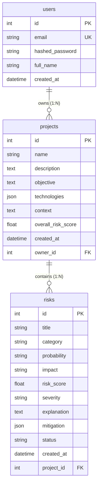

# Technical Specification (TechSpec.md)
## AI Risk Manager — Architecture, Tech Stack, API Reference & Database Model

| Document Attribute | Value |
| :--- | :--- |
| **Document Version** | 1.0.0 |
| **Target Audience** | Software Engineers, System Architects, DevOps, Security Reviewers |
| **Codebase Path** | `d:\Projects\AI-RISK-MANAGER` |
| **Last Updated** | Q3 2026 |

---

## 1. System Architecture Overview

AI Risk Manager is built on a **decoupled, asynchronous client-server architecture**. The system is composed of:
1. **Frontend**: Single Page Application (SPA) built with **React 18 + Vite** providing interactive dashboards, real-time risk simulation, threat radar widgets, and executive reporting.
2. **Backend**: Asynchronous REST API powered by **FastAPI (Python 3.13)** and **Uvicorn**, implementing data validation via **Pydantic v2** and ORM abstraction via **SQLAlchemy 2.0**.
3. **Database Layer**: **SQLite** (`risk_manager.db`) for local development, pre-configured with **SQLAlchemy ORM** for zero-downtime transition to **PostgreSQL**.
4. **AI Intelligence Engine**: Integration with **Google Gemini API** (`google.genai` SDK) utilizing a resilient multi-model fallback chain (`gemini-flash-latest` $\rightarrow$ `gemini-3.6-flash` $\rightarrow$ `gemini-2.5-pro`).

```mermaid
graph TD
    subgraph Client Side
        ReactApp["React 18 SPA (Vite)"]
        Axios["Axios API Client (JWT Interceptor)"]
        ReactApp --> Axios
    end

    subgraph Backend Server (FastAPI)
        AuthRoute["/auth (Register/Login)"]
        ProjRoute["/projects (CRUD & Analyze)"]
        RiskRoute["/risks (Tracking & Status)"]
        AuthService["Auth Service (Bcrypt + JWT)"]
        AIService["AI Service (Gemini Engine)"]
        
        Axios -->|HTTP + Authorization: Bearer <token>| AuthRoute
        Axios --> ProjRoute
        Axios --> RiskRoute
        
        AuthRoute --> AuthService
        ProjRoute --> AIService
    end

    subgraph Persistence & External Services
        DB[("SQLAlchemy Database (SQLite / PostgreSQL)")]
        GeminiAPI["Google Gemini API (google.genai)"]
        
        AuthService --> DB
        ProjRoute --> DB
        RiskRoute --> DB
        AIService -->|Prompts + Config| GeminiAPI
    end
```

---

## 2. Technology Stack & Design Rationale

### 2.1 Backend Stack

| Component | Choice | Why We Chose It (Rationale & Principles) |
| :--- | :--- | :--- |
| **Framework** | **FastAPI 0.141** (Python 3.13) | **High Throughput & Async Native**: FastAPI is built on Starlette and Pydantic, offering execution speed comparable to NodeJS and Go. Its native `async/await` support prevents thread blocking during external API calls (e.g., Gemini API calls). Auto-generates OpenAPI (Swagger) specs at `/docs`. |
| **ASGI Server** | **Uvicorn 0.52** | Lightning-fast ASGI server implementation based on `uvloop` and `httptools`. Handles non-blocking concurrent HTTP connections. |
| **ORM** | **SQLAlchemy 2.0** | Industry standard Python ORM. Provides database-agnostic abstractions, allowing us to develop with file-based SQLite and deploy to production PostgreSQL without altering model definitions. |
| **Data Validation** | **Pydantic v2** | Enforces strict type validation at runtime. Converts request payloads directly to Python models and serializes ORM objects back to JSON with zero boilerplate. |

#### Backend Example: Asynchronous Route Handling & Dependency Injection
```python
@router.post("/projects/{project_id}/analyze", response_model=AnalysisResponse)
async def analyze_risk(
    project_id: int,
    request_body: AnalyzeRequest,
    db: Session = Depends(get_db),
    current_user_id: int = Depends(get_current_user)  # Enforces JWT Auth
):
    # Non-blocking async call to Gemini AI service
    ai_risks = await analyze_project_risks(...)
    return AnalysisResponse(...)
```

---

### 2.2 Frontend Stack

| Component | Choice | Why We Chose It (Rationale & Principles) |
| :--- | :--- | :--- |
| **UI Library** | **React 18** | Virtual DOM rendering, component-driven architecture, and declarative state management. Hooks (`useState`, `useEffect`, `useContext`) enable responsive UI reactivity. |
| **Build Tool** | **Vite 8** | Uses native ES module imports for instant Hot Module Replacement (HMR) during development and optimized Rollup bundling for production ($< 150\text{ms}$ build time). |
| **Routing** | **React Router DOM v6** | Client-side routing with route guards (`PrivateRoute` and `PublicRoute`) to prevent unauthorized access to dashboard views. |
| **HTTP Client** | **Axios 1.x** | Provides centralized request/response interceptors to automatically attach JWT authorization headers and handle global `401 Unauthorized` token expiration logouts. |
| **Styling** | **Vanilla CSS (Design Tokens)** | Custom design system using CSS variables, modern dark mode glassmorphism, flex/grid layouts, and zero heavy CSS framework bloat (e.g., no Tailwind or Bootstrap dependency overhead). |

#### Frontend Example: Centralized Axios Interceptor ([client.js](file:///d:/Projects/AI-RISK-MANAGER/frontend/src/api/client.js))
```javascript
// Auto-attach JWT Bearer token to outgoing HTTP requests
api.interceptors.request.use((config) => {
  const token = localStorage.getItem('token');
  if (token) {
    config.headers.Authorization = `Bearer ${token}`;
  }
  return config;
});

// Global 401 response interceptor for auto-logout
api.interceptors.response.use(
  (response) => response,
  (error) => {
    if (error.response?.status === 401) {
      localStorage.clear();
      window.location.href = '/login';
    }
    return Promise.reject(error);
  }
);
```

---

## 3. Authentication & Security Architecture

### 3.1 Principles
* **Stateless Authorization**: Utilizing JSON Web Tokens (JWT) allows the API server to be entirely stateless. Servers verify request authenticity via cryptographic signature verification without needing session lookup DB calls.
* **Password Hashing (Bcrypt)**: Passwords are NEVER saved in plain text. Passlib executes adaptive `bcrypt` hashing with random salt generation.
* **Tenant Data Isolation**: Every resource (Project, Risk) enforces ownership checks (`WHERE owner_id = current_user_id`). Users cannot read or mutate data belonging to other accounts.

### 3.2 JWT Token Payload & Lifecycle
```json
{
  "sub": "42",                  // Subject claim: User ID as string
  "exp": 1787834567             // Expiration timestamp (24-hour validity)
}
```
* **Algorithm**: `HS256` (HMAC with SHA-256) signed via server-side `SECRET_KEY`.
* **Header Format**: `Authorization: Bearer <access_token>`

---

## 4. Database Schema & Data Models

The database is built on relational principles with 3 core tables: `users`, `projects`, and `risks`.



### 4.1 Schema Definitions

#### `users` Table
| Column Name | Data Type | Constraints | Description |
| :--- | :--- | :--- | :--- |
| `id` | Integer | Primary Key, Indexed | Auto-incrementing User ID |
| `email` | String(255) | Unique, Indexed, Not Null | Account login email |
| `hashed_password` | String(255) | Not Null | Bcrypt hashed password string |
| `full_name` | String(255) | Nullable | Optional user display name |
| `created_at` | DateTime | UTC Timestamp | Account registration timestamp |

#### `projects` Table
| Column Name | Data Type | Constraints | Description |
| :--- | :--- | :--- | :--- |
| `id` | Integer | Primary Key, Indexed | Auto-incrementing Project ID |
| `name` | String(255) | Not Null | Name of the project |
| `description` | Text | Nullable | Detailed scope explanation |
| `objective` | Text | Nullable | Business objective |
| `technologies` | JSON | Nullable | Array of tech tags `["React", "FastAPI"]` |
| `context` | Text | Nullable | Special security/compliance context |
| `overall_risk_score` | Float | Nullable | Average project risk score ($1.0 - 10.0$) |
| `created_at` | DateTime | UTC Timestamp | Creation timestamp |
| `owner_id` | Integer | Foreign Key (`users.id`), Not Null | Owner User ID (Cascade Delete) |

#### `risks` Table
| Column Name | Data Type | Constraints | Description |
| :--- | :--- | :--- | :--- |
| `id` | Integer | Primary Key, Indexed | Auto-incrementing Risk ID |
| `title` | String(500) | Not Null | Short descriptive risk title |
| `category` | String(100) | Not Null | Category (Security, Privacy, Technical, etc.) |
| `probability` | String(50) | Not Null | `Low`, `Medium`, or `High` |
| `impact` | String(50) | Not Null | `Low`, `Medium`, or `High` |
| `risk_score` | Float | Not Null | Derived numerical score ($1.0 - 10.0$) |
| `severity` | String(50) | Not Null | `Low`, `Medium`, `High`, `Critical` |
| `explanation` | Text | Not Null | Detailed AI explanation of the threat |
| `mitigation` | JSON | Nullable | List of actionable mitigation steps |
| `status` | String(50) | Default `"Open"` | `Open`, `Under Review`, `Mitigation in Progress`, `Resolved`, `Accepted` |
| `created_at` | DateTime | UTC Timestamp | Detection timestamp |
| `project_id` | Integer | Foreign Key (`projects.id`), Not Null | Parent Project ID (Cascade Delete) |

---

## 5. AI Engine & Risk Scoring Algorithm

### 5.1 Principle: Deterministic vs. Non-Deterministic Scoring
GenAI models can struggle to produce reliable, mathematically consistent numeric floating point scores across separate runs. 

To solve this, our system delegates **qualitative evaluation** (Probability & Impact classification) to Gemini, but computes the **numeric risk score deterministically** on the backend server.

### 5.2 Mathematical Formula
Given discrete qualitative ratings:
* **Probability Weight ($P$)**: `Low` $= 2$, `Medium` $= 5$, `High` $= 8$
* **Impact Weight ($I$)**: `Low` $= 1$, `Medium` $= 2$, `High` $= 3$
* **Max Raw Score ($P_{\max} \times I_{\max}$)**: $8 \times 3 = 24$

$$\text{Risk Score} = \text{Round}\left( \frac{P \times I}{24} \times 10, \, 1 \right)$$

#### Severity Scale Thresholds
$$\text{Severity} = \begin{cases} 
\text{"Critical"} & \text{if } \text{Risk Score} \ge 8.5 \\ 
\text{"High"} & \text{if } 6.7 \le \text{Risk Score} < 8.5 \\ 
\text{"Medium"} & \text{if } 3.4 \le \text{Risk Score} < 6.7 \\ 
\text{"Low"} & \text{if } \text{Risk Score} < 3.4 
\end{cases}$$

### 5.3 Multi-Model Fallback Resilience
To ensure zero service downtime when Google API models experience high demand or quota limits, `ai_service.py` executes a cascading retry fallback:

$$\text{Call } \texttt{gemini-flash-latest} \longrightarrow \text{(on fail)} \longrightarrow \text{Call } \texttt{gemini-3.6-flash} \longrightarrow \text{(on fail)} \longrightarrow \text{Call } \texttt{gemini-2.5-pro}$$

---

## 6. Complete API Endpoint Specification

### 6.1 Authentication Endpoints

#### `POST /auth/register`
* **Description**: Registers a new user account.
* **Request Body**:
  ```json
  {
    "email": "user@example.com",
    "password": "SecurePassword123!",
    "full_name": "Alex Mercer"
  }
  ```
* **Success Response (201 Created)**:
  ```json
  {
    "id": 1,
    "email": "user@example.com",
    "full_name": "Alex Mercer",
    "created_at": "2026-08-27T14:00:00Z"
  }
  ```
* **Error Response (409 Conflict)**: `{"detail": "An account with this email already exists."}`

#### `POST /auth/login`
* **Description**: Authenticates user credentials and returns JWT token.
* **Request Body**:
  ```json
  {
    "email": "user@example.com",
    "password": "SecurePassword123!"
  }
  ```
* **Success Response (200 OK)**:
  ```json
  {
    "access_token": "eyJhbGciOiJIUzI1Ni...",
    "token_type": "bearer"
  }
  ```

---

### 6.2 Project Endpoints

#### `POST /projects`
* **Headers**: `Authorization: Bearer <token>`
* **Request Body**:
  ```json
  {
    "name": "E-Commerce Payment Gateway v2",
    "description": "Processing online credit card transactions",
    "objective": "Achieve PCI-DSS compliance and zero downtime",
    "technologies": ["React", "FastAPI", "PostgreSQL", "Stripe API"],
    "context": "Stores encrypted credit card tokens and PII"
  }
  ```
* **Success Response (201 Created)**: Returns full `ProjectResponse` object.

#### `GET /projects`
* **Headers**: `Authorization: Bearer <token>`
* **Description**: Lists all projects owned by the logged-in user with associated risk counts.
* **Success Response (200 OK)**:
  ```json
  [
    {
      "id": 1,
      "name": "E-Commerce Payment Gateway v2",
      "description": "Processing online credit card transactions",
      "overall_risk_score": 7.8,
      "created_at": "2026-08-27T14:05:00Z",
      "risk_count": 5
    }
  ]
  ```

#### `GET /projects/{project_id}`
* **Headers**: `Authorization: Bearer <token>`
* **Success Response (200 OK)**: Detailed metadata of project matching `project_id`.

#### `DELETE /projects/{project_id}`
* **Headers**: `Authorization: Bearer <token>`
* **Success Response (204 No Content)**: Project and associated risks deleted via database cascade.

---

### 6.3 Risk Analysis & Tracking Endpoints

#### `POST /projects/{project_id}/analyze`
* **Headers**: `Authorization: Bearer <token>`
* **Description**: Triggers Gemini AI analysis on specified project. Deletes prior analysis risks and generates fresh set.
* **Request Body** *(Optional)*:
  ```json
  {
    "additional_context": "Focus heavily on potential GDPR data residency issues"
  }
  ```
* **Success Response (200 OK)**:
  ```json
  {
    "project_id": 1,
    "project_name": "E-Commerce Payment Gateway v2",
    "overall_risk_score": 7.8,
    "total_risks": 5,
    "risks": [
      {
        "id": 12,
        "title": "Unencrypted Storage of PII Data in Application Cache",
        "category": "Privacy",
        "severity": "High",
        "probability": "High",
        "impact": "High",
        "risk_score": 10.0,
        "explanation": "Caching customer credit card tokens in unencrypted memory exposes the system to data exfiltration upon host compromise.",
        "mitigation": [
          "Enable AES-256 memory encryption for cache layers",
          "Enforce short TTLs on cached authorization tokens",
          "Implement continuous memory scanning"
        ],
        "status": "Open",
        "created_at": "2026-08-27T14:10:00Z",
        "project_id": 1
      }
    ],
    "message": "Analysis complete. Found 5 risks. Overall risk score: 7.8/10"
  }
  ```

#### `GET /projects/{project_id}/risks`
* **Headers**: `Authorization: Bearer <token>`
* **Description**: Fetches all identified risks for project, sorted by `risk_score DESC` (most critical first).

#### `PATCH /risks/{risk_id}/status`
* **Headers**: `Authorization: Bearer <token>`
* **Request Body**:
  ```json
  {
    "status": "Mitigation in Progress"
  }
  ```
* **Allowed Values**: `Open`, `Under Review`, `Mitigation in Progress`, `Resolved`, `Accepted`
* **Success Response (200 OK)**: Updated `RiskResponse` object.

---

## 7. Directory Structure Reference

```
AI-RISK-MANAGER/
├── backend/
│   ├── app/
│   │   ├── models/
│   │   │   └── models.py         # SQLAlchemy User, Project, Risk DB models
│   │   ├── routes/
│   │   │   ├── auth.py           # Registration & Login endpoints
│   │   │   ├── projects.py       # Project CRUD endpoints
│   │   │   └── risks.py          # AI Analysis & Risk status endpoints
│   │   ├── schemas/
│   │   │   └── schemas.py        # Pydantic v2 validation models
│   │   ├── services/
│   │   │   ├── ai_service.py     # Gemini SDK + prompt engine + scoring
│   │   │   └── auth_service.py   # Bcrypt hashing + JWT token verification
│   │   ├── database.py           # DB engine, session factory & get_db dependency
│   │   └── main.py               # FastAPI entrypoint + CORS middleware
│   ├── .env                      # API keys & secret configuration
│   ├── requirements.txt          # Python dependencies
│   └── run.py                    # Server startup runner (Uvicorn launcher)
├── frontend/
│   ├── src/
│   │   ├── api/
│   │   │   └── client.js         # Axios instance with auto-JWT interceptors
│   │   ├── components/           # Threat Radar, Simulator & Report Modals
│   │   ├── context/
│   │   │   └── AuthContext.jsx   # React Auth state management
│   │   ├── pages/                # Dashboard, Project Detail, Login pages
│   │   ├── App.jsx               # React Router layout & private route guards
│   │   ├── index.css             # Vanilla CSS design tokens & utilities
│   │   └── main.jsx              # React app mounting root
│   ├── package.json
│   └── vite.config.js
├── prd.md                        # Product Requirement Document
└── TechSpec.md                   # Technical Specification Document
```
