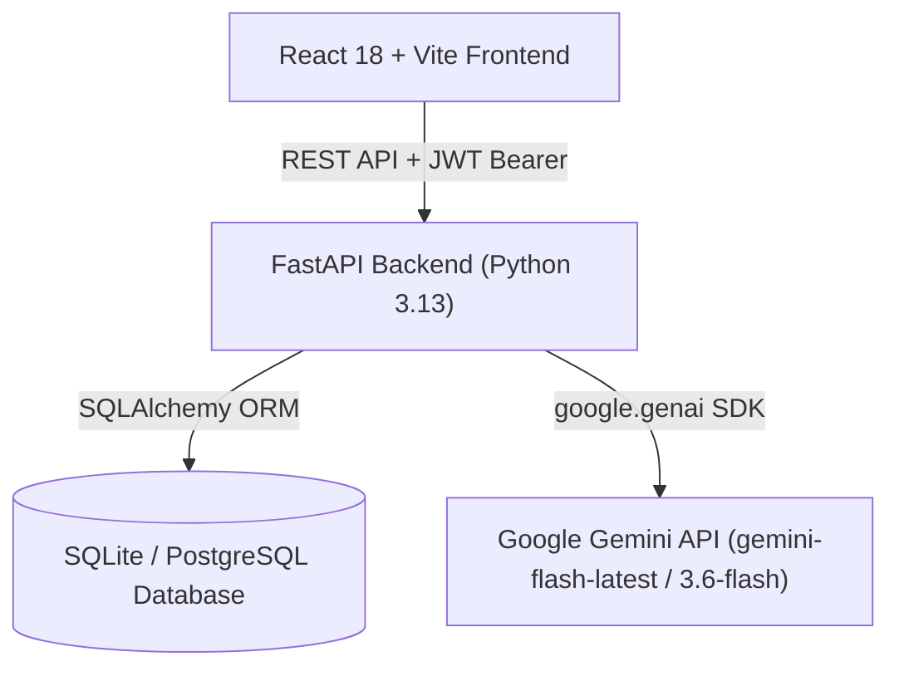

# Product Requirement Document (PRD)
## AI Risk Manager — Next-Gen AI Risk Assessment & Mitigation Platform

| Attribute | Details |
| :--- | :--- |
| **Product Name** | AI Risk Manager |
| **Status** | Active / Production Ready |
| **Version** | 1.0.0 |
| **Target Launch** | Q3 2026 |
| **Author** | Product & Engineering Team |

---

## 1. Problem Statement

### 1.1 Context
In today's fast-moving software development ecosystem, technical teams and business stakeholders struggle to conduct thorough, timely, and holistic risk assessments for new software initiatives, architecture updates, and AI system deployments.

### 1.2 Pain Points
* **Manual & Time-Conserving Risk Audits**: Traditional risk assessments rely on decision meetings, manual checklists, and spreadsheets that often delay project kickoff.
* **Siloed Domain Knowledge**: Security, privacy, compliance, and technical risks are evaluated separately by different experts, leading to critical blind spots (e.g., failing to catch AI hallucination risks or GDPR compliance flaws).
* **Lack of Actionable Mitigation**: Generic compliance frameworks state *what* the problem is, but fail to provide concrete, technology-specific remediation steps for developers.
* **Static Risk Artifacts**: Once created, traditional risk assessments become stale documents rather than dynamic, trackable items updated throughout the development lifecycle.

---

## 2. Product Vision & Goals

**Vision**: To empower engineering leads, product managers, and security officers with an automated, AI-driven risk intelligence platform that analyzes software specifications, identifies multi-dimensional risks within seconds, and offers actionable mitigation plans.

### Core Objectives
1. **Reduce Risk Assessment Time**: Cut project risk evaluation cycles from days to under 15 seconds.
2. **Automate Structured Categorization**: Analyze projects across 8 critical risk dimensions (Security, Privacy, Technical, Financial, Operational, Compliance, Project, AI/Ethical).
3. **Continuous Tracking**: Provide an intuitive dashboard to track risks from identification (`Open`) to resolution (`Resolved` / `Accepted`).

---

## 3. Target User Personas

| Persona | Role | Key Goals & Needs |
| :--- | :--- | :--- |
| **Engineering Managers / Tech Leads** | Technical Oversight | Wants to identify architectural flaws, security risks, and technical debt early in the sprint planning phase. Needs technical, code-level mitigation steps. |
| **Product Managers & Business Owners** | Scope & Delivery Management | Wants to ensure project timelines, budgets, and compliance standards (GDPR/HIPAA) are respected without slowing down delivery. |
| **CISO / Security & Compliance Officers** | Governance & Auditability | Needs high-level threat radar visualizations, risk severity scores (1.0 to 10.0 scale), and executive report generation for audit preparation. |

---

## 4. Core Features & Capabilities

### 4.1 Authentication & Multi-Tenancy Security
* **JWT-Based Authentication**: Secure registration and login flows using industry-standard OAuth2 Bearer tokens.
* **Password Hashing**: Adaptive `bcrypt` password hashing to ensure zero plain-text storage.
* **Data Isolation**: Strict multi-tenant row-level authorization where users can only view, edit, or analyze their owned projects.

### 4.2 Project Lifecycle Management
* **Project Creation**: Capture project name, description, business objectives, tech stack tags (e.g., React, FastAPI, PostgreSQL), and specific architecture context.
* **Project Dashboard**: Lightweight summary list providing overall risk scores, total risk counts, and creation metadata.
* **Project Deletion**: Full cascade deletion of projects and all associated risk items.

### 4.3 AI-Powered Automated Risk Analysis (Google Gemini Engine)
* **Contextual Deep Prompting**: Sends rich project metadata to Gemini models (`gemini-flash-latest`, `gemini-3.6-flash`).
* **Multi-Dimensional Categorization**: Identifies 4 to 8 risks classified under:
  - **Security** (unauthorized access, injection, auth flaws)
  - **Privacy** (GDPR/CCPA, PII exposure, data minimization)
  - **Technical** (scalability, tech debt, integration failure)
  - **Financial** (budget overrun, revenue risk)
  - **Operational** (downtime, key-person dependency)
  - **Compliance** (licensing, regulatory violations)
  - **Project** (scope creep, schedule delay)
  - **AI / Ethical** (model bias, hallucination, explainability)
* **Deterministic Risk Scoring**: Formula-based risk score calculation (1.0–10.0) derived from probability and impact matrices to guarantee consistent priority ranking.
* **Severity Mapping**: Automatic grouping into `Low` (0.0–3.3), `Medium` (3.4–6.6), `High` (6.7–8.4), and `Critical` (8.5–10.0).
* **Actionable Remediation**: Each risk item includes 3–5 concrete, step-by-step mitigation action items.

### 4.4 Risk Tracking & Management
* **Status Workflow**: Update status across lifecycle stages: `Open` $\rightarrow$ `Under Review` $\rightarrow$ `Mitigation in Progress` $\rightarrow$ `Resolved` / `Accepted`.
* **Single Risk Management**: Endpoint for viewing individual risk breakdowns or deleting resolved items.

### 4.5 Interactive Analytics & Executive Insights
* **Threat Radar & Visual Widgets**: Interactive breakdown of risk distribution across categories.
* **Risk Simulator Modal**: Interactive sandbox allowing users to model hypothetical scenario changes.
* **Executive Report Modal**: One-click summary exportable for leadership reviews.

---

## 5. Technical Architecture & Tech Stack

### Stack Components
* **Frontend**: React 18, Vite, React Router v6, Axios (with auto JWT header injection and 401 interceptors), Vanilla CSS custom design system.
* **Backend**: FastAPI (Python 3.13), Uvicorn ASGI Server, Pydantic v2, Python-Jose (JWT), Passlib (Bcrypt).
* **Database**: SQLite for local dev (`risk_manager.db`), PostgreSQL-ready via SQLAlchemy ORM.
* **AI Provider**: `google.genai` SDK with multi-model fallback mechanism (`gemini-flash-latest` $\rightarrow$ `gemini-3.6-flash` $\rightarrow$ `gemini-2.5-pro`).

---

## 6. Success Criteria & Key Performance Indicators (KPIs)

| Metric Category | Key Performance Indicator (KPI) | Target Benchmark |
| :--- | :--- | :--- |
| **Performance** | AI Analysis Latency | $< 15$ seconds per full project analysis |
| **API Reliability** | Endpoint Availability / Uptime | $> 99.9\%$ success rate on `/analyze` |
| **User Engagement** | Risk Remediation Rate | $> 70\%$ of identified `Critical` & `High` risks transitioned to `Mitigation in Progress` or `Resolved` |
| **Accuracy & Value** | Mitigation Actionability Score | $> 90\%$ user satisfaction on AI-generated remediation steps |
| **Security Standard** | Vulnerability / Auth Audit | 0 unauthenticated access breaches across project resources |

---

## 7. Future Roadmap

* **Phase 2 (Q4 2026)**: Automated GitHub / GitLab repository scanning to auto-populate technology stack and architectural context.
* **Phase 3 (Q1 2027)**: Slack & Jira integration for automated ticket creation when `Critical` risks are identified.
* **Phase 4 (Q2 2027)**: Custom Organization-wide Compliance Framework mapping (SOC2, ISO 27001, NIST AI RMF).
