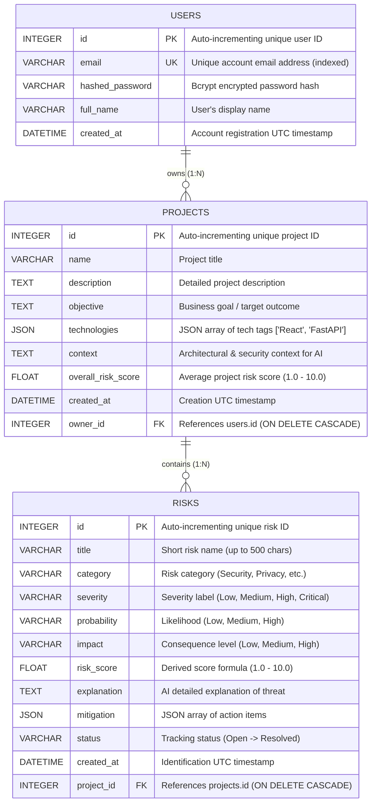

# Database Schema & Data Dictionary (schema.md)
## AI Risk Manager — Comprehensive Database Architecture & Field Reference

This document provides the complete database specification for **AI Risk Manager**, detailing the relational schema, entity relationships, data types, constraints, serialization formats, cascade mechanics, and raw SQL creation scripts.

---

## 1. Entity Relationship Diagram (ERD)



---

## 2. Table Specifications & Data Dictionary

### 2.1 Table: `users`
Stores registered user accounts and authentication credentials.

| Column Name | Data Type | Constraints | Default | Description |
| :--- | :--- | :--- | :--- | :--- |
| `id` | `INTEGER` | Primary Key, Auto-Increment, Indexed | *Auto* | Unique identifier for each user account. |
| `email` | `VARCHAR(255)` | Unique, Indexed, NOT NULL | *None* | User's login email address. Enforces uniqueness. |
| `hashed_password` | `VARCHAR(255)` | NOT NULL | *None* | Adaptive `bcrypt` password hash string (never plain-text). |
| `full_name` | `VARCHAR(255)` | NULLABLE | `NULL` | Optional display name of the user. |
| `created_at` | `DATETIME` | NOT NULL | `UTC Now` | UTC timestamp when the user account was registered. |

#### Python ORM Mapping ([models.py](file:///d:/Projects/AI-RISK-MANAGER/backend/app/models/models.py))
```python
class User(Base):
    __tablename__ = "users"

    id = Column(Integer, primary_key=True, index=True)
    email = Column(String(255), unique=True, index=True, nullable=False)
    hashed_password = Column(String(255), nullable=False)
    full_name = Column(String(255), nullable=True)
    created_at = Column(DateTime, default=lambda: datetime.now(timezone.utc))

    # Relationships
    projects = relationship("Project", back_populates="owner", cascade="all, delete-orphan")
```

---

### 2.2 Table: `projects`
Stores software project definitions, business objectives, tech stack, and overall calculated risk scores.

| Column Name | Data Type | Constraints | Default | Description |
| :--- | :--- | :--- | :--- | :--- |
| `id` | `INTEGER` | Primary Key, Auto-Increment, Indexed | *Auto* | Unique identifier for each project. |
| `name` | `VARCHAR(255)` | NOT NULL | *None* | Title of the software project. |
| `description` | `TEXT` | NULLABLE | `NULL` | Long text description of project functionality. |
| `objective` | `TEXT` | NULLABLE | `NULL` | Core business goal or compliance target. |
| `technologies` | `JSON` | NULLABLE | `NULL` | JSON array string storing technology stack tags. |
| `context` | `TEXT` | NULLABLE | `NULL` | Security, data handling, and architectural context for AI. |
| `overall_risk_score` | `FLOAT` | NULLABLE | `NULL` | Floating point score ($1.0 - 10.0$). `NULL` until first AI analysis. |
| `created_at` | `DATETIME` | NOT NULL | `UTC Now` | UTC timestamp when the project was created. |
| `owner_id` | `INTEGER` | Foreign Key (`users.id`), NOT NULL | *None* | Links project to owner user. |

#### Python ORM Mapping ([models.py](file:///d:/Projects/AI-RISK-MANAGER/backend/app/models/models.py))
```python
class Project(Base):
    __tablename__ = "projects"

    id = Column(Integer, primary_key=True, index=True)
    name = Column(String(255), nullable=False)
    description = Column(Text, nullable=True)
    objective = Column(Text, nullable=True)
    technologies = Column(JSON, nullable=True)
    context = Column(Text, nullable=True)
    overall_risk_score = Column(Float, nullable=True)
    created_at = Column(DateTime, default=lambda: datetime.now(timezone.utc))
    owner_id = Column(Integer, ForeignKey("users.id"), nullable=False)

    # Relationships
    owner = relationship("User", back_populates="projects")
    risks = relationship("Risk", back_populates="project", cascade="all, delete-orphan")
```

---

### 2.3 Table: `risks`
Stores individual identified risks generated by Gemini AI, including scores, severities, explanations, mitigation checklists, and tracking status.

| Column Name | Data Type | Constraints | Default | Description |
| :--- | :--- | :--- | :--- | :--- |
| `id` | `INTEGER` | Primary Key, Auto-Increment, Indexed | *Auto* | Unique identifier for each risk item. |
| `title` | `VARCHAR(500)` | NOT NULL | *None* | Descriptive title of the identified risk. |
| `category` | `VARCHAR(100)` | NOT NULL | *None* | Category: `Security`, `Privacy`, `Technical`, `Financial`, `Operational`, `Compliance`, `Project`, `AI/Ethical`. |
| `severity` | `VARCHAR(50)` | NOT NULL | *None* | `Low`, `Medium`, `High`, or `Critical`. |
| `probability` | `VARCHAR(50)` | NOT NULL | *None* | Likelihood of occurrence: `Low`, `Medium`, or `High`. |
| `impact` | `VARCHAR(50)` | NOT NULL | *None* | Business impact level: `Low`, `Medium`, or `High`. |
| `risk_score` | `FLOAT` | NOT NULL | *None* | Derived numeric score between $1.0$ and $10.0$. |
| `explanation` | `TEXT` | NOT NULL | *None* | AI explanation detailing why this risk exists. |
| `mitigation` | `JSON` | NULLABLE | `NULL` | JSON array of actionable step-by-step mitigation items. |
| `status` | `VARCHAR(50)` | NOT NULL | `"Open"` | Tracking status: `Open`, `Under Review`, `Mitigation in Progress`, `Resolved`, `Accepted`. |
| `created_at` | `DATETIME` | NOT NULL | `UTC Now` | UTC timestamp when the risk was generated. |
| `project_id` | `INTEGER` | Foreign Key (`projects.id`), NOT NULL | *None* | References parent project. |

#### Python ORM Mapping ([models.py](file:///d:/Projects/AI-RISK-MANAGER/backend/app/models/models.py))
```python
class Risk(Base):
    __tablename__ = "risks"

    id = Column(Integer, primary_key=True, index=True)
    title = Column(String(500), nullable=False)
    category = Column(String(100), nullable=False)
    severity = Column(String(50), nullable=False)
    probability = Column(String(50), nullable=False)
    impact = Column(String(50), nullable=False)
    risk_score = Column(Float, nullable=False)
    explanation = Column(Text, nullable=False)
    mitigation = Column(JSON, nullable=True)
    status = Column(String(50), default="Open")
    created_at = Column(DateTime, default=lambda: datetime.now(timezone.utc))
    project_id = Column(Integer, ForeignKey("projects.id"), nullable=False)

    # Relationships
    project = relationship("Project", back_populates="risks")
```

---

## 3. Relationships & Cascade Mechanics

### 3.1 User $\rightarrow$ Projects (1-to-Many)
* **Foreign Key**: `projects.owner_id` $\rightarrow$ `users.id`
* **Cardinality**: One user can own multiple projects. Each project belongs to exactly one user.
* **Cascade Behavior**: `cascade="all, delete-orphan"`. Deleting a user automatically deletes all projects owned by that user.

### 3.2 Project $\rightarrow$ Risks (1-to-Many)
* **Foreign Key**: `risks.project_id` $\rightarrow$ `projects.id`
* **Cardinality**: One project contains multiple risks. Each risk belongs to exactly one project.
* **Cascade Behavior**: `cascade="all, delete-orphan"`. Deleting a project automatically deletes all associated risks.
* **Re-analysis Wipe**: Executing `POST /projects/{id}/analyze` runs `db.query(Risk).filter(Risk.project_id == project_id).delete()` to replace previous risks with fresh AI findings.

---

## 4. Data Storage & Serialization Rules

### 4.1 JSON Column Serialization
SQLite and PostgreSQL natively support JSON types via SQLAlchemy `JSON`:
* **`projects.technologies`**: Stored as `["React", "FastAPI", "PostgreSQL"]`. Retried in Python directly as a list of strings.
* **`risks.mitigation`**: Stored as `["Enable AES-256 memory encryption", "Enforce short TTLs"]`.

### 4.2 Date & Time Standardization
All timestamps (`created_at`) are generated using Python's `datetime.now(timezone.utc)`. Using explicit UTC guarantees timezone consistency regardless of host server location.

### 4.3 Password Cryptographic Storage
Passwords are hashed using `bcrypt` via Passlib (`hash_password()`). Example stored value in `users.hashed_password`:
`$2b$12$KIXu3.yZ9uN2f4H9jX5bVeO8dM7rC3a1L6k0w4z8y5x9v3u2t1s0`

---

## 5. Raw SQL Creation Scripts (DDL)

For database administrators running migrations manually, here are the native ANSI SQL creation statements:

```sql
-- 1. Create Users Table
CREATE TABLE users (
    id INTEGER PRIMARY KEY AUTOINCREMENT,
    email VARCHAR(255) NOT NULL UNIQUE,
    hashed_password VARCHAR(255) NOT NULL,
    full_name VARCHAR(255) DEFAULT NULL,
    created_at DATETIME NOT NULL DEFAULT CURRENT_TIMESTAMP
);

CREATE INDEX ix_users_id ON users (id);
CREATE UNIQUE INDEX ix_users_email ON users (email);


-- 2. Create Projects Table
CREATE TABLE projects (
    id INTEGER PRIMARY KEY AUTOINCREMENT,
    name VARCHAR(255) NOT NULL,
    description TEXT DEFAULT NULL,
    objective TEXT DEFAULT NULL,
    technologies JSON DEFAULT NULL,
    context TEXT DEFAULT NULL,
    overall_risk_score FLOAT DEFAULT NULL,
    created_at DATETIME NOT NULL DEFAULT CURRENT_TIMESTAMP,
    owner_id INTEGER NOT NULL,
    FOREIGN KEY (owner_id) REFERENCES users (id) ON DELETE CASCADE
);

CREATE INDEX ix_projects_id ON projects (id);


-- 3. Create Risks Table
CREATE TABLE risks (
    id INTEGER PRIMARY KEY AUTOINCREMENT,
    title VARCHAR(500) NOT NULL,
    category VARCHAR(100) NOT NULL,
    severity VARCHAR(50) NOT NULL,
    probability VARCHAR(50) NOT NULL,
    impact VARCHAR(50) NOT NULL,
    risk_score FLOAT NOT NULL,
    explanation TEXT NOT NULL,
    mitigation JSON DEFAULT NULL,
    status VARCHAR(50) NOT NULL DEFAULT 'Open',
    created_at DATETIME NOT NULL DEFAULT CURRENT_TIMESTAMP,
    project_id INTEGER NOT NULL,
    FOREIGN KEY (project_id) REFERENCES projects (id) ON DELETE CASCADE
);

CREATE INDEX ix_risks_id ON risks (id);
```
